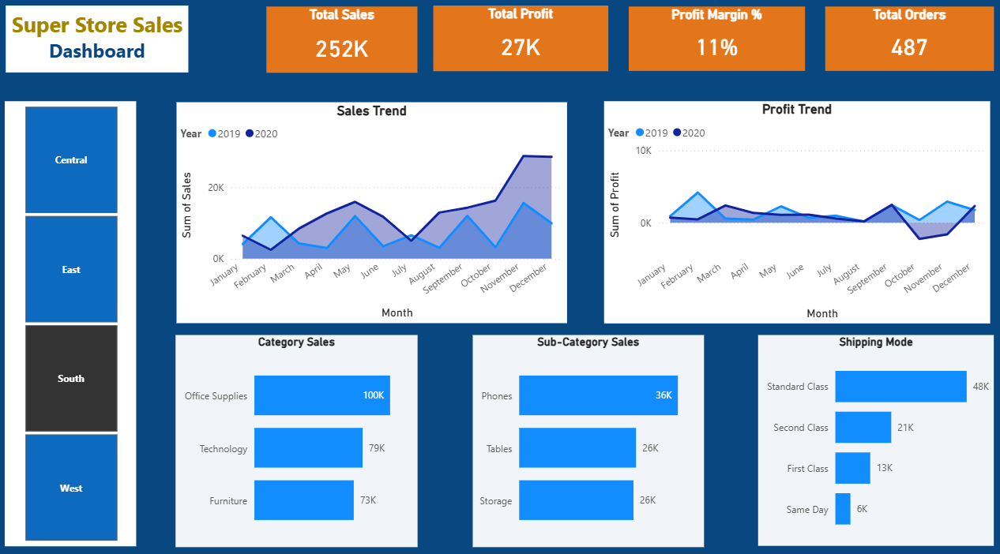

# superstore-powerbi-dashboard

## 📌 Overview
This project presents an interactive Power BI dashboard analyzing sales performance, profitability, and business insights.

## 📊 Dashboard Preview

## 🎯 Key Features
- KPI Cards: Total Sales, Total Profit, Profit Margin, Total Orders
- Monthly Sales & Profit Trend (YoY)
- Category & Sub-Category Analysis
- Shipping Mode Analysis
- Region-based filtering (interactive slicer)

## 🔍 Key Insights
- Sales increased while profit dropped in some periods due to high discounts or costs
- Certain transactions resulted in negative profit
- Performance varies significantly across categories and regions

## 📊 Business Insights
- Sales showed an increasing trend over time, especially in 2020
- Profit fluctuated and was negative in some months, indicating cost or discount issues
- Certain sub-categories contributed more to revenue but not necessarily to profit
- Shipping mode analysis shows majority of orders use standard delivery

## 🛠 Tools Used
- Power BI
- DAX
